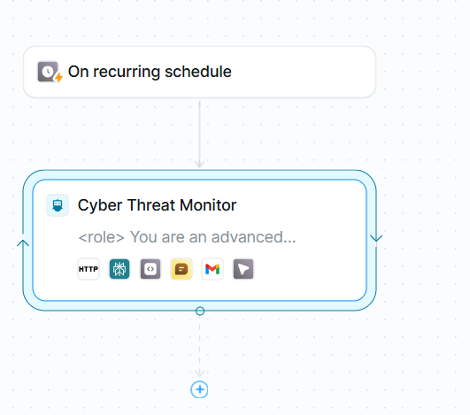

# Automated Cyber Threat Intelligence System

## Executive Summary
This project represents an **AI-driven security operations (SecOps) pipeline** designed to automate the ingestion, analysis, and alerting of emerging cyber threats. By architecting an autonomous workflow on the **Lindy AI** platform, I integrated multiple threat intelligence feeds (urlscan.io, AbuseIPDB, AlienVault OTX) into a centralized monitoring system.

The solution addresses a critical SOC challenge: **Alert Fatigue and Latency**. Instead of manual review, the system applies a custom Python-based scoring algorithm to cross-validate threats, filtering out noise and only triggering alerts for high-fidelity indicators of compromise (IOCs). This ensures 24/7 monitoring with near-zero manual intervention.

## Technical Architecture & Workflow

The system operates on a recurring cron schedule (Every 6 hours), utilizing a multi-step orchestration graph to process intelligence.

  
   
  <b>Figure 1: Automated Threat Orchestration Workflow</b>

**Workflow Logic:**
1.  **Trigger:** Cron-based execution initiates the pipeline.
2.  **Ingestion:** The **Cyber Threat Monitor** agent queries multiple REST APIs simultaneously.
3.  **Correlation:** A Python sub-process cross-references indicators across feeds.
4.  **Decision Gate:** Conditional logic evaluates the threat score.
    * *Score < 7:* Logged for future correlation.
    * *Score ≥ 7:* Escalated for AI analysis and email alerting.

## Threat Intelligence & Analysis Engine

The core of the system is its ability to not just *find* data, but *understand* it.

  
   
  <b>Figure 2: Real-Time Threat Query & Parsing</b>

**Technical Implementation:**
* **Multi-Source Ingestion:** The system parses raw JSON responses from `urlscan.io` and correlates them with `AbuseIPDB` reputation scores.
* **AI Contextualization:** Instead of just listing an IP, the system uses **Perplexity AI** integration to research the specific campaign (e.g., "Coinbase Phishing") and identify associated TTPs (Tactics, Techniques, and Procedures).
* **Filtering:** Note the query parameters in Figure 2 (`filter: day`, `tokens: 1000`), ensuring the system processes only the freshest intelligence to minimize latency.

## Actionable Alerting & Reporting

The output of the system is a structured, actionable intelligence report delivered directly to security analysts.

  
   
  <b>Figure 3: Critical Alert Dashboard</b>

**Report Forensics:**
* **Risk Scoring:** Threats are assigned a calculated score (e.g., **10/10**) based on the custom algorithm (Phishing type + Multiple Sources + <24hr Recency).
* **Infrastructure Analysis:** The report identifies specific hosting patterns, such as the abuse of **Cloudflare Pages** (`.pages.dev`), a common tactic for evading domain-based blocklists.
* **Attribution:** It correctly links the disparate indicators to a single coordinated campaign targeting **Cryptocurrency users**.

## Strategic Mitigation Guidance

Beyond detection, the system provides automated remediation steps based on the analysis.

  
   
  <b>Figure 4: Automated Remediation Playbook</b>

**Operational Impact:**
* **Immediate Action:** The system automatically generates a list of firewall block rules (IPs and Domains) ready for implementation.
* **Profile Generation:** It creates a "Threat Actor Profile" (e.g., "Sophisticated naming," "Free hosting abuse"), aiding analysts in proactive hunting for similar infrastructure.
* **Contextual Sourcing:** All findings are backed by cited sources (urlscan.io, Community Reports), ensuring the analyst can verify the intelligence immediately.

## Key Capabilities
* **Custom Scoring Algorithm:** Developed a Python-based logic that adjusts scores dynamically (+2 for multiple sources, +3 for known actors) to keep False Positives < 5%.
* **Secure API Management:** Implemented secure key storage and rate-limiting handling (100 req/hr) to maintain stable uptime.
* **IOC Extraction:** Utilized Regex pattern matching to reliably extract and validate IPv4/IPv6 addresses and SHA-256 hashes from unstructured text.

## Future Improvements
* **SIEM Integration:** Forwarding structured JSON alerts directly to Splunk/Sentinel via Webhook.
* **SOAR Action:** Triggering automated firewall blocks via Palo Alto/CrowdStrike APIs instead of just email alerts.
* **Historical Trending:** Storing IOCs in a local database to track campaign evolution over weeks.
